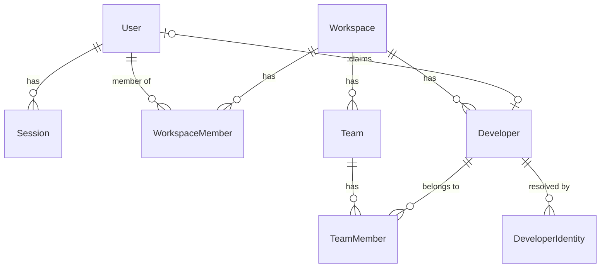
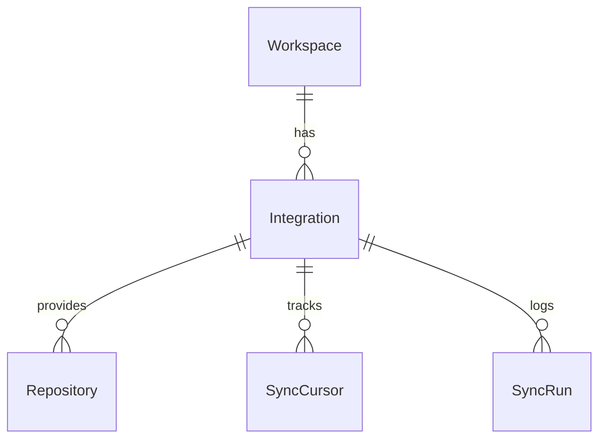
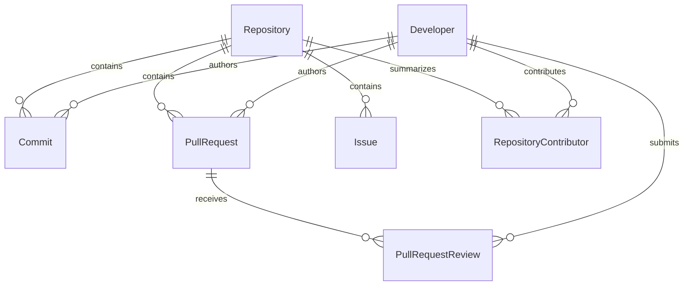

# 01 — Data Model

> **Read first:** [00-overview.md](00-overview.md) · **Read next:** [02-pipeline.md](02-pipeline.md)
> **Decisions behind this document:** [ADR-0001](adr/0001-metric-storage-shape.md) ·
> [ADR-0002](adr/0002-developer-identity-resolution.md) · [ADR-0005](adr/0005-tenancy-enforcement.md)

---

## 1. Organizing principle

The schema is split into four layers, and the layer a table belongs to determines how it is
written, read and expired:

| Layer | Tables | Written by | Read by | Mutability |
|---|---|---|---|---|
| **Tenancy & identity** | `User`, `Session`, `Workspace`, `WorkspaceMember`, `Team`, `TeamMember`, `Developer`, `DeveloperIdentity` | API (user actions) | API | Mutable |
| **Integration** | `Integration`, `SyncCursor`, `SyncRun` | API + worker | Worker | Mutable |
| **Staging** | `RawEvent` | Ingest stage | Normalize stage | Append + status flip |
| **Domain** | `Repository`, `Commit`, `PullRequest`, `PullRequestReview`, `Issue`, `RepositoryContributor` | Normalize stage | Aggregate stage, API | Upsert-only |
| **Analytics** | `MetricSnapshot`, `*DailyRollup`, `ScoreSnapshot`, `Insight` | Aggregate/metric/insight stages | API | Recomputable |

The important property: **everything in the analytics layer is derived and can be rebuilt from
the domain layer**. If a formula is wrong, the fix is a recompute, not a data-loss event. The
domain layer is in turn rebuildable from the provider. This makes the system safe to iterate on.

### 1.1 Conventions applied to every table

- Primary key `id` — CUID2, generated in the application (stable ids without a round trip).
- `createdAt` / `updatedAt` on all mutable tables.
- `workspaceId` on **every** table below the tenancy layer, with an FK and a leading index.
- Timestamps are `timestamptz`, always UTC. Timezone conversion happens once, at the workspace
  boundary, when bucketing days ([02 §5](02-pipeline.md)).
- Durations are stored as **integer minutes**, never as floats or intervals — they are summed,
  averaged and compared constantly, and integers make those operations exact.
- Provider identifiers are stored as `externalId TEXT`, never as a numeric type. GitHub node ids
  are strings, and GitLab ids are numeric; a text column absorbs both without a migration.

---

## 2. Tenancy and identity



### 2.1 `User` — a platform account

| Column | Type | Notes |
|---|---|---|
| `id` | text PK | |
| `email` | citext | **unique**, case-insensitive |
| `passwordHash` | text? | null for OAuth-only accounts |
| `name`, `avatarUrl` | text? | |
| `emailVerifiedAt` | timestamptz? | |
| `lastLoginAt` | timestamptz? | |

`UserOAuthAccount(userId, provider, providerUserId, createdAt)` — unique on
`(provider, providerUserId)` — supports account linking (§56 of the PRD): the same person
signing in with GitHub and with email lands on one `User`.

### 2.2 `Session`

| Column | Type | Notes |
|---|---|---|
| `id` | text PK | |
| `userId` | text FK | cascade delete |
| `tokenHash` | text | **SHA-256 of the token**; the raw token is never stored |
| `expiresAt` | timestamptz | |
| `rotatedFromId` | text? | rotation chain; reuse of a rotated token revokes the whole chain |
| `ip`, `userAgent` | text? | for the sessions list and audit |

Indexes: `(userId)`, `(tokenHash)` unique, `(expiresAt)` for cleanup.

### 2.3 `Workspace` — the tenant boundary

| Column | Type | Notes |
|---|---|---|
| `id` | text PK | |
| `name` | text | |
| `slug` | citext | **unique** |
| `ownerUserId` | text FK | |
| `retentionDays` | int? | null = unlimited (§78) |
| `timezone` | text | IANA name, default `UTC`; drives day bucketing |
| `weekStartsOn` | int | 0–6, default 1 (Monday) |

### 2.4 `WorkspaceMember` — RBAC binding

`(workspaceId, userId)` unique. `role` ∈ `OWNER | ADMIN | MANAGER | MEMBER | VIEWER`.
Permission mapping lives in [04-api.md §5](04-api.md).

### 2.5 `Developer` — the metric subject

This is **not** a user account. It is a person as observed in git history, scoped to one
workspace.

| Column | Type | Notes |
|---|---|---|
| `id` | text PK | |
| `workspaceId` | text FK | |
| `displayName` | text | |
| `primaryEmail` | citext? | |
| `avatarUrl` | text? | |
| `claimedByUserId` | text? FK | set when a platform user proves they are this developer |
| `isBot` | boolean | dependabot, renovate, CI accounts — excluded from all people metrics |
| `mergedIntoId` | text? FK → Developer | set when two developers are merged; queries follow the pointer |

Indexes: `(workspaceId, isBot)`, `(workspaceId, claimedByUserId)`, `(mergedIntoId)`.

### 2.6 `DeveloperIdentity` — the resolution table

A commit knows an **email**. A pull request knows a **provider user id**. These are different
keys for the same person, and treating them as one field is the single most common way this
kind of model breaks. See [ADR-0002](adr/0002-developer-identity-resolution.md).

| Column | Type | Notes |
|---|---|---|
| `id` | text PK | |
| `workspaceId` | text FK | |
| `developerId` | text FK | |
| `provider` | enum | `GITHUB \| GITLAB \| GIT` (`GIT` = a bare commit email) |
| `kind` | enum | `PROVIDER_USER \| EMAIL` |
| `value` | citext | the login/node-id, or the email address |
| `confidence` | enum | `EXACT \| INFERRED \| MANUAL` |

**Unique:** `(workspaceId, provider, kind, value)` — one identity resolves to exactly one
developer. Index: `(workspaceId, developerId)`.

Resolution order during ingestion:
1. Exact match on `(provider, PROVIDER_USER, id)` → `EXACT`.
2. Exact match on `(GIT, EMAIL, email)` → `EXACT`.
3. Provider-supplied email matches an existing identity's email → link as `INFERRED`.
4. No match → create an unclaimed `Developer` plus its identity.

An admin can merge two developers; the merge sets `mergedIntoId`, repoints identities, and
enqueues a recompute of the affected rollups. Nothing is deleted, so a wrong merge is reversible.

### 2.7 `Team` / `TeamMember`

`TeamMember` references **`developerId`**, not `userId`. Teams exist to aggregate engineering
activity, and activity attaches to developers; requiring every team member to have a platform
account would make team metrics incomplete on day one.

`Team(workspaceId, slug)` unique · `TeamMember(teamId, developerId)` unique.

---

## 3. Integration and sync state



### 3.1 `Integration`

| Column | Type | Notes |
|---|---|---|
| `id` | text PK | |
| `workspaceId` | text FK | |
| `provider` | enum | `GITHUB \| GITLAB \| BITBUCKET \| SEED` |
| `externalAccountId` | text | org or user id at the provider |
| `accountLogin` | text | display only |
| `accessTokenEnc` | bytea | **AES-256-GCM**, never leaves the server, never serialized |
| `refreshTokenEnc` | bytea? | |
| `tokenExpiresAt` | timestamptz? | |
| `scopes` | text[] | granted scopes, checked before a sync attempts a resource |
| `webhookSecretEnc` | bytea? | |
| `status` | enum | `ACTIVE \| TOKEN_EXPIRED \| REVOKED \| ERROR` |
| `lastSyncedAt` | timestamptz? | |

Unique: `(workspaceId, provider, externalAccountId)`.

### 3.2 `SyncCursor` — what makes incremental sync possible

| Column | Type | Notes |
|---|---|---|
| `integrationId` | text FK | |
| `repositoryId` | text? FK | null for account-level resources |
| `resource` | enum | `REPOSITORIES \| COMMITS \| PULL_REQUESTS \| REVIEWS \| ISSUES` |
| `cursor` | text? | opaque provider cursor / page token |
| `since` | timestamptz? | high-water mark for time-filtered endpoints |
| `status` | enum | `IDLE \| RUNNING \| FAILED` |
| `lastSyncedAt`, `lastError` | | |

Unique: `(integrationId, repositoryId, resource)`.

The cursor is advanced **only after a page is fully persisted**. A crash mid-page re-fetches
that page, which is safe because normalization is an upsert ([ADR-0004](adr/0004-pipeline-idempotency.md)).

### 3.3 `SyncRun` — one observable unit of work

`(id, workspaceId, integrationId, kind INITIAL|INCREMENTAL|BACKFILL|WEBHOOK, status, startedAt,
finishedAt, stats jsonb, error)`. `stats` holds per-resource counts, which is what the sync
progress UI streams over SSE.

---

## 4. Staging

### 4.1 `RawEvent`

Everything a provider gives us lands here first, unchanged.

| Column | Type | Notes |
|---|---|---|
| `id` | text PK | |
| `workspaceId` | text FK | |
| `integrationId` | text FK | |
| `provider` | enum | |
| `eventType` | text | `commit`, `pull_request`, `pull_request_review`, `issue`, … |
| `externalId` | text | the entity id at the provider |
| `contentHash` | text | SHA-256 of the normalized payload |
| `deliveryId` | text? | webhook delivery id, when the source is a webhook |
| `payload` | jsonb | verbatim |
| `status` | enum | `PENDING \| PROCESSED \| FAILED \| SKIPPED` |
| `attempts` | int | |
| `receivedAt`, `processedAt`, `error` | | |

**Unique:** `(provider, eventType, externalId, contentHash)`.
Index: `(status, receivedAt)` — partial, `WHERE status = 'PENDING'`.

Why keep raw payloads at all: when a metric looks wrong six weeks later, the question is always
"did we receive bad data, or compute it badly?" Without staging, that question is unanswerable.
Raw events are pruned on the workspace retention schedule (§8).

---

## 5. Domain layer



### 5.1 `Repository`

| Column | Type | Notes |
|---|---|---|
| `id`, `workspaceId`, `integrationId` | | |
| `externalId` | text | |
| `owner`, `name`, `fullName` | text | |
| `defaultBranch` | text | |
| `isPrivate`, `isArchived`, `isFork` | boolean | |
| `primaryLanguage` | text? | |
| `languages` | jsonb | `{ "TypeScript": 184320, "CSS": 9210 }` — bytes per language |
| `stars`, `forks`, `openIssuesCount` | int | provider snapshot |
| `createdAtRemote`, `pushedAtRemote` | timestamptz | |
| `syncEnabled` | boolean | user chooses which repositories are tracked |
| `trackedAt` | timestamptz | when it entered the workspace |

Unique: `(workspaceId, provider, externalId)`. Indexes: `(workspaceId, syncEnabled)`,
`(workspaceId, fullName)`, GIN trigram on `fullName` for search.

### 5.2 `Commit`

| Column | Type | Notes |
|---|---|---|
| `id`, `workspaceId`, `repositoryId` | | |
| `sha` | text | |
| `authorDeveloperId` | text? FK | resolved via `DeveloperIdentity` |
| `committerDeveloperId` | text? FK | |
| `authoredAt`, `committedAt` | timestamptz | **`authoredAt` is the metric timestamp** |
| `message` | text | first line kept for display |
| `additions`, `deletions`, `changedFiles` | int | |
| `isMerge` | boolean | `parentCount > 1` |

Unique: `(repositoryId, sha)`.
Indexes: `(workspaceId, authoredAt)`, `(repositoryId, authoredAt)`,
`(workspaceId, authorDeveloperId, authoredAt)` — that last composite serves nearly every
developer-activity query.

> `authoredAt` rather than `committedAt`, because rebases and cherry-picks rewrite commit dates
> and would otherwise teleport a month of work into a single afternoon.

### 5.3 `PullRequest` — with lifecycle timings materialized

The PR table stores both the raw lifecycle timestamps **and** the derived durations. The
durations are computed once, at normalize time, because §37 forbids recomputing history on every
dashboard load, and because "time to first review" needs the review rows anyway.

| Column | Type | Notes |
|---|---|---|
| `id`, `workspaceId`, `repositoryId`, `externalId` | | |
| `number` | int | |
| `title` | text | |
| `state` | enum | `OPEN \| MERGED \| CLOSED` |
| `isDraft` | boolean | draft time is excluded from review-latency metrics |
| `authorDeveloperId` | text? FK | |
| `mergedByDeveloperId` | text? FK | |
| `baseBranch`, `headBranch` | text | |
| `additions`, `deletions`, `changedFiles`, `commitCount` | int | size — used to bucket PRs |
| `createdAtRemote` | timestamptz | |
| `readyForReviewAt` | timestamptz? | draft → ready transition; the clock starts here |
| `firstReviewAt` | timestamptz? | earliest non-author review |
| `firstApprovalAt` | timestamptz? | |
| `mergedAt`, `closedAt` | timestamptz? | |
| `reviewRounds` | int | count of `CHANGES_REQUESTED` → new-commits cycles |
| `reopenCount` | int | |
| `timeToFirstReviewMinutes` | int? | `firstReviewAt − (readyForReviewAt ?? createdAtRemote)` |
| `reviewDurationMinutes` | int? | `(mergedAt ?? closedAt) − firstReviewAt` |
| `cycleTimeMinutes` | int? | `mergedAt − (readyForReviewAt ?? createdAtRemote)` |

Unique: `(repositoryId, number)`.
Indexes: `(workspaceId, state)`, `(workspaceId, authorDeveloperId, createdAtRemote)`,
`(repositoryId, createdAtRemote)`, and a **partial** index
`(workspaceId, repositoryId) WHERE state = 'OPEN'` — the open-PR count is on the dashboard's hot
path and this keeps it off the full table.

> Nulls are meaningful here. `timeToFirstReviewMinutes IS NULL` means *not yet reviewed*, which
> is different from zero. Every aggregate in [03](03-algorithms.md) states explicitly whether it
> excludes nulls or treats them as censored observations.

### 5.4 `PullRequestReview`

| Column | Type | Notes |
|---|---|---|
| `id`, `workspaceId`, `repositoryId`, `pullRequestId`, `externalId` | | |
| `reviewerDeveloperId` | text? FK | |
| `state` | enum | `APPROVED \| CHANGES_REQUESTED \| COMMENTED \| DISMISSED` |
| `submittedAt` | timestamptz | |
| `commentCount` | int | |
| `responseTimeMinutes` | int? | from PR ready (or from the previous round) to this review |

Unique: `(repositoryId, externalId)`.
Indexes: `(pullRequestId, submittedAt)`, `(workspaceId, reviewerDeveloperId, submittedAt)`.

Individual review comments are **not** modeled in the MVP — `commentCount` carries the signal
the metrics need, and per-comment rows multiply row count by an order of magnitude for no MVP
metric. The table can be added later without touching anything above it.

### 5.5 `Issue`

`(id, workspaceId, repositoryId, externalId, number, title, state OPEN|CLOSED,
authorDeveloperId, assigneeDeveloperId, createdAtRemote, closedAt, resolutionTimeMinutes,
labels text[], isFromPullRequest boolean)`.

Unique `(repositoryId, number)`. `labels` is a text array with a GIN index rather than a join
table: labels are provider-defined strings that are only ever filtered on, never joined.

### 5.6 `RepositoryContributor` — a maintained summary

One row per `(repositoryId, developerId)`, updated by the aggregate stage:
`commits, additions, deletions, prsAuthored, prsMerged, reviewsGiven, firstContributionAt,
lastContributionAt, contributionShare numeric(5,4)`.

This exists so bus-factor and ownership analysis ([03 §8](03-algorithms.md)) is a small indexed
read instead of a scan over every commit in the repository's history.

---

## 6. Analytics layer

Two shapes, deliberately. The reasoning is in [ADR-0001](adr/0001-metric-storage-shape.md);
the summary is that history and reads have opposite access patterns.

### 6.1 `MetricSnapshot` — the narrow history table

```text
(workspaceId, subjectType, subjectId, metricKey, granularity, periodStart) → value
```

| Column | Type | Notes |
|---|---|---|
| `subjectType` | enum | `DEVELOPER \| REPOSITORY \| TEAM \| WORKSPACE` |
| `subjectId` | text | polymorphic; not an FK — validated by the writer |
| `metricKey` | enum | closed set, see [03 §2](03-algorithms.md) |
| `granularity` | enum | `DAY \| WEEK \| MONTH` |
| `periodStart` | date | in workspace timezone |
| `value` | numeric(18,4) | |
| `sampleSize` | int | how many observations produced it — guards against noisy medians |
| `computedAt` | timestamptz | |

Unique: `(workspaceId, subjectType, subjectId, metricKey, granularity, periodStart)`.
Index: `(workspaceId, metricKey, granularity, periodStart)` for cross-subject queries.

Every trend and anomaly algorithm reads **only** this table. That is why adding a new metric
never requires a migration: it is a new `metricKey`, not a new column.

### 6.2 `*DailyRollup` — the wide read tables

`DeveloperDailyRollup`, `RepositoryDailyRollup`, `TeamDailyRollup`. One row per subject per day,
PK `(workspaceId, subjectId, day)`.

```text
DeveloperDailyRollup
  commits, additions, deletions, prsOpened, prsMerged, prsClosed,
  reviewsGiven, reviewsReceived, issuesClosed, activeRepositories,
  medianTimeToFirstReviewMinutes, medianCycleTimeMinutes

RepositoryDailyRollup
  commits, activeContributors, prsOpened, prsMerged, prsClosed, openPrsAtEnd,
  medianTimeToFirstReviewMinutes, medianCycleTimeMinutes,
  issuesOpened, issuesClosed, openIssuesAtEnd, reviewCount

TeamDailyRollup
  activeDevelopers, commits, prsOpened, prsMerged, reviewsGiven,
  medianTimeToFirstReviewMinutes, medianCycleTimeMinutes, openPrsAtEnd
```

A 90-day dashboard is then one indexed range scan of ≤90 rows per subject. No joins, no
aggregation, no window functions at request time.

> **On materialized views.** They were considered and rejected for the MVP: `REFRESH
> MATERIALIZED VIEW` is all-or-nothing, while rollups are naturally *incremental* — a webhook
> touches one repository on one day. Recomputing a single `(subject, day)` cell is cheap;
> refreshing a whole view is not.

### 6.3 `ScoreSnapshot` — scores with their explanation attached

Scores are kept apart from metrics because they carry a component breakdown and a weights
version, and because attaching a `jsonb` column to every metric row would be wasteful.

| Column | Type | Notes |
|---|---|---|
| `workspaceId`, `subjectType`, `subjectId` | | |
| `scoreKey` | enum | `DEVELOPER_HEALTH \| REPOSITORY_HEALTH \| TEAM_HEALTH` |
| `granularity`, `periodStart` | | |
| `value` | numeric(6,2) | 0–100 |
| `components` | jsonb | `[{ key, raw, normalized, weight, contribution }]` |
| `version` | text | weights version, e.g. `dev-score@1.0.0` |
| `computedAt` | timestamptz | |

Unique: `(workspaceId, subjectType, subjectId, scoreKey, granularity, periodStart)`.

Storing `components` is what makes §15's "the score must be explainable" mechanical: the
explanation of a change is the diff of two rows' component arrays, not a hand-written sentence.
Storing `version` is what keeps history honest — changing weights next quarter does not silently
rewrite last quarter's numbers.

### 6.4 `Insight`

| Column | Type | Notes |
|---|---|---|
| `workspaceId`, `subjectType`, `subjectId` | | |
| `ruleId` | text | e.g. `review-latency-regression` |
| `severity` | enum | `POSITIVE \| INFO \| WARNING \| CRITICAL` |
| `title`, `body` | text | rendered from a template + evidence |
| `evidence` | jsonb | the numbers the sentence is built from |
| `metricKey` | enum? | |
| `changePercent` | numeric? | |
| `periodStart`, `periodEnd`, `detectedAt` | | |
| `status` | enum | `ACTIVE \| ACKNOWLEDGED \| RESOLVED \| EXPIRED` |
| `dedupeKey` | text | `ruleId:subjectType:subjectId:periodStart` |

Unique: `(workspaceId, dedupeKey)`. Without it, every pipeline run would re-emit the same
warning and the notification centre would be unusable within a day.

---

## 7. Operational tables

`Notification(workspaceId, userId, type, insightId?, title, body, readAt, createdAt)` —
index `(userId, readAt, createdAt DESC)`.

`Report(workspaceId, type, format, params jsonb, status, storageKey, requestedByUserId,
createdAt, completedAt)` — generation is a queued job, never a request.

`AuditLog(workspaceId, actorUserId, action, resourceType, resourceId, ip, userAgent,
metadata jsonb, createdAt)` — index `(workspaceId, createdAt DESC)`, `(workspaceId, actorUserId)`.
Append-only; no update or delete path exists in the API.

---

## 8. Tenancy enforcement

Full reasoning in [ADR-0005](adr/0005-tenancy-enforcement.md). The mechanism:

```ts
// src/db — every request/job runs inside a tenant context
export const tenantClient = (workspaceId: string) =>
  prisma.$extends({
    query: {
      $allModels: {
        async $allOperations({ model, args, query, operation }) {
          if (!TENANT_SCOPED_MODELS.has(model)) return query(args);
          if (READ_OPS.has(operation)) {
            args.where = { ...args.where, workspaceId };
          } else if (CREATE_OPS.has(operation)) {
            args.data = { ...args.data, workspaceId };
          }
          return query(args);
        },
      },
    },
  });
```

Three properties make this trustworthy:

1. Handlers receive an already-scoped client; the raw `prisma` export is lint-banned outside
   `src/db`.
2. `TENANT_SCOPED_MODELS` is derived from the Prisma DMMF — any model with a `workspaceId`
   field is automatically covered, so a new table is protected the moment it is added rather
   than when someone remembers to register it.
3. An integration test enumerates every scoped model and asserts that a query from workspace A
   cannot read a row from workspace B. Adding an unprotected table fails CI.

Raw SQL (`$queryRaw`) bypasses extensions and is therefore restricted to a reviewed set of
analytics queries that take `workspaceId` as their first bound parameter.

---

## 9. Retention and growth

`Workspace.retentionDays` ∈ `30 | 90 | 365 | null` (§78). A nightly job deletes, in order:

1. `RawEvent` older than `min(retentionDays, 30)` — staging is never the long-term store.
2. Domain rows older than `retentionDays`.
3. `MetricSnapshot` at `DAY` granularity older than `retentionDays`; **`WEEK` and `MONTH`
   snapshots are kept regardless**, so long-range trend charts survive retention. Aggregates are
   not personal data in the way raw commit history is, and keeping them costs almost nothing.

**Growth estimate** for a 50-developer, 40-repository workspace over one year:

| Table | Approx. rows/year | Note |
|---|---|---|
| `Commit` | ~120 k | dominant domain table |
| `PullRequest` | ~12 k | |
| `PullRequestReview` | ~30 k | |
| `MetricSnapshot` | ~1.6 M | 90 subjects × ~35 metrics × 365 days + week/month |
| `DeveloperDailyRollup` | ~18 k | |

Comfortable for a single Postgres instance. If `Commit` or `MetricSnapshot` becomes the
bottleneck, both are natural candidates for monthly range partitioning on their time column —
the schema is already shaped for it (time-leading indexes, no cross-period foreign keys), so
that is a later optimization and not a rewrite.

---

## 10. Seed dataset

`SeedProvider` ([02 §3](02-pipeline.md)) generates 12 months of activity from a fixed PRNG seed:
8 repositories, 14 developers (2 flagged as bots), realistic weekday/weekend rhythm, two
deliberately planted signals — a review-latency regression in one repository during the last 30
days, and a knowledge concentration of ~62% in a `payment-core` repository.

Those planted signals are what the insight and bus-factor tests assert against. Because the seed
is fixed, the expected values are exact numbers rather than ranges, and a change in an algorithm
shows up as a failing assertion instead of a slightly different-looking chart.
