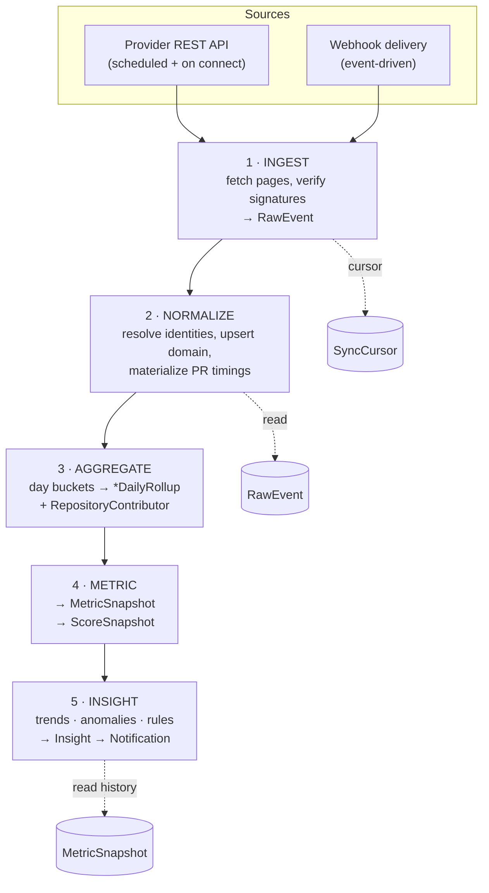
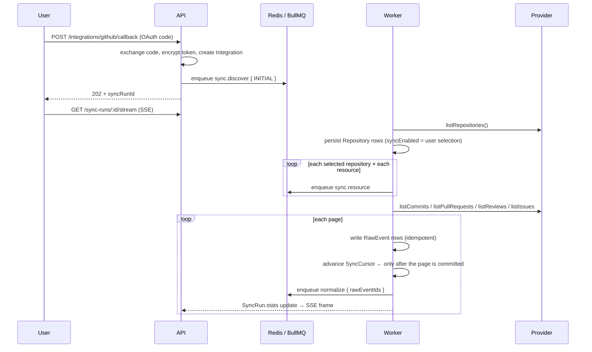
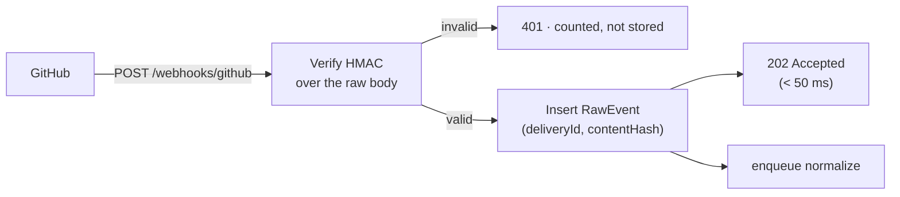

# 02 — Data Pipeline

> **Read first:** [01-data-model.md](01-data-model.md) · **Read next:** [03-algorithms.md](03-algorithms.md)
> **Decision behind this document:** [ADR-0004](adr/0004-pipeline-idempotency.md)

---

## 1. Shape of the pipeline



Five stages, five queues, one rule that governs all of them:

> **Every stage must produce the same result whether it runs once, twice, or is interrupted
> halfway and restarted.**

Provider APIs time out, webhooks are delivered more than once, workers get redeployed
mid-batch. A pipeline that is only correct on the happy path is a pipeline that silently
corrupts metrics, and a corrupted metric is worse than a missing one because nobody notices.

Each stage is a separate queue rather than one long job because the stages have genuinely
different characteristics: ingest is I/O-bound and rate-limited, normalize is transactional,
aggregate and metric are CPU-bound and safely parallel across subjects. They need different
concurrency, different retry policy, and independent failure isolation.

---

## 2. Queues

| Queue | Concurrency | Attempts | Backoff | Job payload |
|---|---|---|---|---|
| `sync.discover` | 2 | 3 | exp 5 s | `{ integrationId, kind }` |
| `sync.resource` | 4 / integration | 5 | exp 10 s, rate-limit aware | `{ integrationId, repositoryId, resource, cursor }` |
| `normalize` | 8 | 5 | exp 2 s | `{ workspaceId, rawEventIds[] }` |
| `aggregate` | 8 | 3 | exp 5 s | `{ workspaceId, subjectType, subjectId, days[] }` |
| `metric` | 4 | 3 | exp 5 s | `{ workspaceId, subjectType, subjectId, granularity, periods[] }` |
| `insight` | 2 | 3 | exp 10 s | `{ workspaceId, periodStart }` |
| `report` | 2 | 2 | fixed 30 s | `{ reportId }` |
| `maintenance` | 1 | 1 | — | retention, cursor repair, orphan cleanup |

**Job ids are deterministic.** A job's id is a hash of its payload
(`aggregate:{workspaceId}:{subjectId}:{day}`), so BullMQ's own deduplication prevents the same
unit of work from being queued twice when a burst of webhooks lands on the same repository in
the same minute.

**Rate limiting** is per integration, not global — one workspace exhausting its GitHub quota
must not stall every other workspace. `sync.resource` uses a BullMQ group limiter keyed by
`integrationId`, and a `429` or an exhausted `X-RateLimit-Remaining` reschedules the job for
`X-RateLimit-Reset` rather than burning retry attempts.

**Failures** exhaust their attempts into a dead-letter set with the full payload and error.
`SyncRun.status` becomes `FAILED` with the failing resource recorded, the UI surfaces it on the
integration page, and a retry re-enqueues from the last committed cursor — never from zero.

---

## 3. The provider abstraction

Everything above the provider layer is written against this interface. GitHub is one
implementation; the deterministic seed generator is another; GitLab is a third, added in Phase 2
without touching any stage.

```ts
// src/providers
export interface GitProvider {
  readonly kind: 'github' | 'gitlab' | 'seed';

  listRepositories(ctx: ProviderContext): AsyncIterable<Page<RawRepository>>;

  listCommits(
    ctx: ProviderContext,
    repo: RepoRef,
    opts: { since?: Date; cursor?: string },
  ): AsyncIterable<Page<RawCommit>>;

  listPullRequests(ctx, repo, opts): AsyncIterable<Page<RawPullRequest>>;
  listReviews(ctx, repo, prNumber): AsyncIterable<Page<RawReview>>;
  listIssues(ctx, repo, opts): AsyncIterable<Page<RawIssue>>;

  verifyWebhook(headers: Headers, rawBody: Buffer): WebhookVerification;
  parseWebhook(eventType: string, payload: unknown): RawEnvelope[];
}

export interface Page<T> {
  items: T[];
  cursor: string | null;          // null ⇒ last page
  rateLimit?: { remaining: number; resetAt: Date };
}
```

Three properties of this interface matter:

- **It yields pages, not arrays.** A provider must never materialize an organization's entire
  commit history in memory, and the cursor is what the ingest stage checkpoints.
- **It returns `Raw*` DTOs, not database rows.** Provider-shaped data is normalized in the next
  stage; GitHub's field names never reach the domain model.
- **It performs no writes.** The provider cannot corrupt state, which makes it trivially
  testable and makes `SeedProvider` a drop-in.

`SeedProvider` implements the same contract over a fixed-seed PRNG. `DATA_PROVIDER=seed` runs
the entire system — sync, metrics, scores, insights, dashboards — with no network access and no
GitHub account, which is why CI can exercise the full pipeline on every push.

---

## 4. Stage 1 — Ingest

### 4.1 Initial sync



Ordering within a repository is **PRs → reviews → issues → commits**. Reviews reference their
pull request, so fetching them after PRs avoids orphan rows and a second resolution pass.
Commits are last because they are the largest volume and the least order-sensitive.

The cursor advances only after its page is durably written. A crash therefore re-fetches at most
one page, and re-ingesting a page is a no-op thanks to the `RawEvent` uniqueness key.

**Backfill depth** is bounded on first connect: 12 months by default, configurable per
integration. Unbounded history on a large organization is hours of rate-limited paging for data
almost nobody looks at; a later `BACKFILL` run can extend it on request.

### 4.2 Incremental sync

Scheduled every 15 minutes per active integration, and the safety net beneath webhooks.

```text
for each (repository, resource):
    since  = SyncCursor.since ?? repository.trackedAt
    fetch  = provider.list<Resource>({ since })
    ...persist, then set SyncCursor.since = max(updatedAt seen) − 5 min overlap
```

The five-minute overlap is deliberate. Provider `updated_at` values are not perfectly monotonic
across paginated reads, and re-processing a handful of already-seen records costs nothing
because the whole path is idempotent — whereas a missed record is invisible and permanent.

### 4.3 Webhooks



Rules, in order of importance:

1. **Verify before parsing.** The HMAC is computed over the *raw* body, so the webhook route
   uses a raw body parser and signature verification runs before any JSON parsing.
2. **Acknowledge fast, process later.** The handler stores and returns. Providers retry on slow
   responses, and processing inside the request is how one slow database query turns into a
   flood of duplicate deliveries.
3. **Redeliveries are free.** `(provider, eventType, externalId, contentHash)` is unique, so a
   replayed delivery collapses into the row that already exists.

Subscribed events: `push`, `pull_request`, `pull_request_review`, `pull_request_review_comment`,
`issues`, `issue_comment`, `repository`, `member`.

Webhooks reduce latency; they are never trusted as the only path. Deliveries are dropped by
outages and misconfiguration, so the 15-minute incremental sync remains the source of
completeness.

---

## 5. Stage 2 — Normalize

Input: `RawEvent` rows with `status = 'PENDING'`. Output: upserted domain rows. One transaction
per batch.

```text
for each raw event:
    1. resolve actors     → DeveloperIdentity lookup, else create unclaimed Developer
    2. map provider fields → domain columns
    3. upsert              on the natural key (repositoryId, sha) / (repositoryId, number)
    4. recompute derived   → PR lifecycle timings
    5. mark PROCESSED, collect (subjectId, day) pairs touched
finally: enqueue aggregate for the collected pairs
```

### 5.1 Identity resolution

The three-layer model from [01 §2.6](01-data-model.md) in operation:

```ts
function resolveDeveloper(ws: string, actor: RawActor): DeveloperId {
  if (actor.providerUserId)
    if (const hit = findIdentity(ws, actor.provider, 'PROVIDER_USER', actor.providerUserId))
      return hit.developerId;

  if (actor.email)
    if (const hit = findIdentity(ws, 'GIT', 'EMAIL', actor.email))
      return hit.developerId;

  // provider account known, commit email new → attach the email to the same person
  if (actor.providerUserId && actor.email) {
    const dev = createOrGetByProviderUser(ws, actor);
    attachIdentity(ws, dev, 'GIT', 'EMAIL', actor.email, 'INFERRED');
    return dev;
  }

  return createUnclaimedDeveloper(ws, actor);   // EXACT identity on whichever key we have
}
```

Bots (`login` ending in `[bot]`, or on the workspace bot list) get `Developer.isBot = true` and
are excluded from every people-facing metric while still counting toward repository activity —
Dependabot keeps a repository's commit graph alive but must never appear in a review-load chart.

### 5.2 Materializing PR lifecycle timings

Computed here, once, rather than at read time:

```text
clockStart        = readyForReviewAt ?? createdAtRemote        -- draft time excluded
firstReviewAt     = min(review.submittedAt) where reviewer ≠ author
firstApprovalAt   = min(review.submittedAt) where state = APPROVED and reviewer ≠ author
reviewRounds      = count of CHANGES_REQUESTED reviews followed by a later commit
timeToFirstReview = firstReviewAt − clockStart
reviewDuration    = coalesce(mergedAt, closedAt) − firstReviewAt
cycleTime         = mergedAt − clockStart                      -- null unless merged
```

Two exclusions worth stating, because both otherwise poison the numbers:

- **Self-reviews do not count.** An author approving their own PR would make review latency zero.
- **Draft time does not count.** A PR left in draft for a week did not wait a week for a
  reviewer, and counting it would blame reviewers for authors' habits.

A review arriving by webhook re-runs this block for its PR — which is why it is a pure function
of the PR's current review rows rather than an incremental mutation.

---

## 6. Stage 3 — Aggregate

Input: `(subjectType, subjectId, day)` pairs. Output: `*DailyRollup` rows and
`RepositoryContributor` updates.

**Day bucketing uses the workspace timezone**, resolved once per job:

```sql
date_trunc('day', c.authored_at AT TIME ZONE w.timezone)::date
```

A team in Tehran whose evening commits get filed under the next UTC day sees a heatmap that
disagrees with their memory of the week, and that single mismatch discredits every other number
on the page. The workspace timezone is therefore part of the aggregation key, and changing it
enqueues a full rollup recompute.

Each cell is written as a full recomputation of that `(subject, day)` from the domain layer, not
as an increment:

```sql
INSERT INTO developer_daily_rollup (...) VALUES (...)
ON CONFLICT (workspace_id, developer_id, day) DO UPDATE SET ...
```

Recompute-and-replace rather than `count = count + 1` is what makes replays safe. An increment
applied twice is silently wrong forever; a recomputation applied twice produces the same row.

Medians (`medianTimeToFirstReviewMinutes`) use `percentile_cont(0.5)` over the PRs *finishing*
that day. Medians rather than means throughout: one PR left open over a holiday shifts a mean by
hours and a median not at all.

---

## 7. Stage 4 — Metric

Reads rollups, writes `MetricSnapshot` (`DAY`, then `WEEK` and `MONTH` derived from days), then
computes scores.

```ts
// the whole stage, in outline
const inputs = await loadMetricInputs(ws, subject, period);   // I/O
const score  = computeDeveloperScore(inputs, WEIGHTS);        // pure — src/analytics
await upsertScoreSnapshot({ ...score, subject, period });     // I/O
```

The middle line performs no I/O and knows nothing about Prisma, HTTP or the clock. That
separation is what allows [03](03-algorithms.md)'s formulas to be tested against fixtures with
exact expected values.

`ScoreSnapshot.version` is written from the weights constant. When weights change, the version
changes, and a `metric` recompute job is enqueued for the affected range — old rows are replaced
under a new version rather than mutated, so a chart never mixes two scoring generations.

---

## 8. Stage 5 — Insight

```mermaid
flowchart LR
    hist[("MetricSnapshot<br/>history")] --> trend["Trend detection<br/>period vs period"]
    hist --> anom["Anomaly detection<br/>rolling median + MAD"]
    scores[("ScoreSnapshot")] --> delta["Score component diff"]
    graph[("RepositoryContributor")] --> bus["Concentration<br/>bus factor"]

    trend --> rules["Rule registry"]
    anom --> rules
    delta --> rules
    bus --> rules

    rules --> dedupe["Dedupe on<br/>ruleId:subject:period"]
    dedupe --> ins[("Insight")]
    ins --> notif["Notification"]
```

Every rule implements one interface, which is what keeps the engine deterministic and testable:

```ts
export interface InsightRule {
  id: string;
  severity: Severity;
  subjects: SubjectType[];
  evaluate(ctx: InsightContext): InsightDraft | null;   // pure
}
```

`evaluate` receives the metric history it needs and returns a draft or nothing. It cannot query
the database, so a rule can be unit-tested by handing it a fabricated history. Rendering happens
outside the rule from a template plus `evidence`, so the same rule produces English and Persian
text without duplication.

Deduplication on `(ruleId, subject, periodStart)` is not a nicety. Without it, the 15-minute
incremental sync re-emits every active warning four times an hour and the notification centre
becomes noise the user learns to ignore — at which point the product's most valuable output has
been destroyed by its least interesting bug.

Rules and their thresholds are enumerated in [03 §9](03-algorithms.md).

---

## 9. Recompute and backfill

Three ways the derived layers get rebuilt, all of them ordinary jobs:

| Trigger | Scope | Path |
|---|---|---|
| Weights version changed | all subjects, chosen range | `metric` → `insight` |
| Developers merged | affected subjects, full history | `aggregate` → `metric` → `insight` |
| Aggregation bug fixed | one workspace or all, chosen range | `aggregate` → `metric` → `insight` |
| Workspace timezone changed | all subjects, full history | `aggregate` → … |
| Re-ingest from provider | one repository | `sync.resource` → `normalize` → … |

Recompute is a first-class operation, not an emergency procedure, because the derived layers are
disposable by design ([01 §1](01-data-model.md)). Jobs run at low priority behind live sync so a
backfill never delays a user's fresh data.

---

## 10. Progress and observability

**Progress** streams over SSE from `SyncRun.stats`, updated after each page:

```text
event: progress
data: {"syncRunId":"...","phase":"pull_requests","repository":"acme/frontend",
       "processed":1840,"total":2310,"percent":79}
```

SSE rather than WebSocket because the flow is one-directional server→client and terminates when
the run does; a bidirectional socket would be infrastructure with no corresponding requirement.

**Instrumentation.** Each stage records duration, item count, and failure count as OpenTelemetry
metrics, with a trace id propagated from the originating request or webhook delivery through
every downstream job — so "why is this repository's dashboard stale?" resolves to a single trace
rather than a log search.

Alert-worthy signals: queue depth growth over 15 minutes, dead-letter arrivals, `SyncCursor`
age beyond one hour on an active integration, webhook signature failures (a wrong secret or a
forgery attempt — both need attention), and stage p95 duration.

---

## 11. Failure semantics, summarized

| Failure | Behaviour |
|---|---|
| Provider 5xx / timeout | Retry with exponential backoff; cursor unmoved; page re-fetched |
| Provider 429 | Reschedule at `X-RateLimit-Reset`; no retry attempt consumed |
| Token expired | `Integration.status = TOKEN_EXPIRED`, sync paused, user notified to reconnect |
| Worker killed mid-page | At most one page re-fetched; upserts absorb the duplicates |
| Duplicate webhook | Collapses on the `RawEvent` uniqueness key |
| Malformed payload | `RawEvent.status = FAILED` with the error; the batch continues |
| Normalize transaction fails | Whole batch rolls back; raw events stay `PENDING`; retried |
| Aggregate runs twice | Identical result — cells are recomputed, never incremented |
| Insight rule throws | That rule is skipped and logged; other rules still emit |

The through-line: **failures cost time, never correctness**. That is the property that makes it
safe to run this pipeline unattended, and the reason each stage is written as recompute-and-
replace rather than mutate-in-place.
