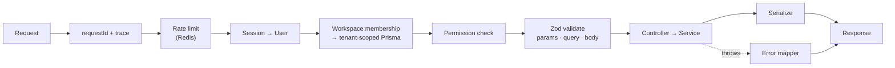

# 04 — API

> **Read first:** [01-data-model.md](01-data-model.md) · **Read next:** [05-frontend.md](05-frontend.md)
> **Decision behind this document:** [ADR-0005](adr/0005-tenancy-enforcement.md)

---

## 1. Principles

- **Versioned from the first commit.** Everything lives under `/api/v1`. Retrofitting a version
  prefix after clients exist is a migration; starting with one is free.
- **Tenancy is in the path.** Workspace-scoped resources are
  `/api/v1/workspaces/:workspaceId/…`. Tenancy visible in the URL is tenancy that middleware can
  check, logs can carry, and a reviewer can see at a glance — a header or a session-implied
  workspace is none of those.
- **One schema per payload.** A Zod schema is the runtime validator *and* the source of the
  TypeScript type *and* the OpenAPI fragment. Three artifacts that can never drift apart.
- **Controllers translate, services decide.** A controller that branches on business meaning is
  a bug ([00 §4.1](00-overview.md)).
- **Reads are cheap by construction.** Analytics endpoints read pre-computed rollups and
  snapshots. No endpoint aggregates raw history at request time.

---

## 2. Request lifecycle



The order is deliberate: rate limiting precedes authentication so credential-stuffing costs the
attacker before it costs the database, and the tenant client is constructed *before* any handler
runs so no handler can reach an unscoped client.

---

## 3. Conventions

### 3.1 Response envelope

```jsonc
// success
{ "data": { /* … */ }, "meta": { "requestId": "req_2f9…" } }

// collection
{
  "data": [ /* … */ ],
  "pagination": { "nextCursor": "eyJpZCI6…", "hasMore": true, "limit": 50 },
  "meta": { "requestId": "req_2f9…" }
}

// error
{
  "error": {
    "code": "VALIDATION_ERROR",
    "message": "Invalid query parameters",
    "details": [{ "path": "period", "message": "Expected one of 7d, 30d, 90d, 6m, 1y, all" }],
    "requestId": "req_2f9…"
  }
}
```

`requestId` appears in the response, in every log line, and in the Sentry event — a user pasting
one string into a support conversation is enough to retrieve the entire trace.

### 3.2 Error codes

| Code | HTTP | Meaning |
|---|---|---|
| `VALIDATION_ERROR` | 400 | Body, query or params failed schema validation |
| `UNAUTHENTICATED` | 401 | Missing, expired or reused session |
| `FORBIDDEN` | 403 | Authenticated, but the role lacks the permission |
| `NOT_FOUND` | 404 | Absent **or** outside the caller's workspace |
| `CONFLICT` | 409 | Uniqueness violation (slug taken, integration exists) |
| `UNPROCESSABLE` | 422 | Valid shape, invalid domain state (sync already running) |
| `RATE_LIMITED` | 429 | With `Retry-After` |
| `PROVIDER_ERROR` | 502 | Upstream provider failed |
| `INTERNAL` | 500 | Unexpected; message is generic, details go to logs only |

A resource in another workspace returns **404, never 403**. A 403 confirms the resource exists,
which turns the id space into an enumeration oracle.

### 3.3 Pagination

Cursor-based everywhere. Offset pagination on tables that receive continuous writes silently
skips and duplicates rows as the underlying data shifts, and every large table here receives
continuous writes.

```text
GET /…/commits?limit=50&cursor=eyJpZCI6ImNrOSJ9
limit: 1–100, default 50
cursor: opaque base64 of the last row's sort key
```

### 3.4 Shared query parameters

```text
period      7d | 30d | 90d | 6m | 1y | all | custom
from, to    ISO dates, required when period=custom
granularity day | week | month        (default derived from the range)
repositoryId, developerId, teamId, language, prState, issueState, branch, label
  — repeatable, AND across parameter types, OR within one
```

Filters are combinable, as §27 requires, and every analytics endpoint accepts the same set —
parsed by one shared Zod schema rather than re-declared per route.

---

## 4. Authentication

### 4.1 Sessions

Opaque tokens in an `httpOnly` `Secure` `SameSite=Lax` cookie. The database stores a SHA-256
hash, never the token itself; a database leak therefore does not yield usable sessions.

```text
access session   30 minutes,  rotated on use
refresh session  30 days,     rotated on every refresh
```

**Reuse detection:** if a rotated refresh token is presented again, the entire session chain is
revoked and an `AuditLog` entry is written. That is the standard defence against a stolen
refresh token — the thief's use and the victim's use are indistinguishable individually, but the
*second* use of a rotated token proves that one of them happened.

JWTs were considered and rejected. The system needs immediate revocation (logout everywhere,
role change, reuse detection), which a stateless token cannot provide without a revocation list
— at which point the statelessness is gone and the complexity is not.

### 4.2 Endpoints

```text
POST   /api/v1/auth/register              email, password, name
POST   /api/v1/auth/login                 → sets cookies
POST   /api/v1/auth/logout                revokes current session
POST   /api/v1/auth/logout-all            revokes every session for the user
POST   /api/v1/auth/refresh               rotates; reuse revokes the chain
GET    /api/v1/auth/me                    user + workspace memberships
GET    /api/v1/auth/oauth/:provider       → redirect, state in a signed cookie
GET    /api/v1/auth/oauth/:provider/callback
POST   /api/v1/auth/link/:provider        link a provider to the signed-in user
DELETE /api/v1/auth/link/:provider        refused if it is the only credential
GET    /api/v1/auth/sessions              active sessions
DELETE /api/v1/auth/sessions/:id
```

Passwords are hashed with **Argon2id**. Login is rate limited per IP *and* per email, and
responds in constant time whether or not the account exists.

OAuth `state` is a signed, single-use, 10-minute cookie value verified on callback — without it
the callback is a CSRF entry point that can attach an attacker's provider account to a victim's
session.

---

## 5. Authorization

Five roles (§57), permissions checked per endpoint — never inferred from the role at the call
site, so adding a role does not mean auditing every handler.

| Permission | Owner | Admin | Manager | Member | Viewer |
|---|---|---|---|---|---|
| `workspace.read` | ✓ | ✓ | ✓ | ✓ | ✓ |
| `workspace.manage` | ✓ | ✓ | | | |
| `workspace.delete` | ✓ | | | | |
| `members.read` | ✓ | ✓ | ✓ | ✓ | ✓ |
| `members.manage` | ✓ | ✓ | | | |
| `team.read` | ✓ | ✓ | ✓ | ✓ | ✓ |
| `team.manage` | ✓ | ✓ | ✓ | | |
| `repository.read` | ✓ | ✓ | ✓ | ✓ | ✓ |
| `repository.manage` | ✓ | ✓ | ✓ | | |
| `analytics.read` | ✓ | ✓ | ✓ | ✓ | ✓ |
| `analytics.team` | ✓ | ✓ | ✓ | | |
| `insights.manage` | ✓ | ✓ | ✓ | | |
| `reports.create` | ✓ | ✓ | ✓ | ✓ | |
| `integrations.manage` | ✓ | ✓ | | | |
| `audit.read` | ✓ | ✓ | | | |
| `settings.retention` | ✓ | ✓ | | | |

```ts
router.get(
  '/workspaces/:workspaceId/teams/:teamId/analytics',
  requirePermission('analytics.team'),
  validate({ params: TeamParams, query: AnalyticsQuery }),
  teamController.analytics,
);
```

**One additional rule, from §79.** A `MEMBER` may read their own developer profile in full, and
team-level aggregates, but not another member's individual score breakdown. That requires
`analytics.team`. The restriction is in the product's design, not only its permissions: it is
what keeps the tool from becoming the peer-comparison instrument the PRD explicitly rejects.

---

## 6. Endpoints

### 6.1 Workspaces, teams, members

```text
GET    /api/v1/workspaces                                  memberships of the caller
POST   /api/v1/workspaces                                  { name, slug, timezone }
GET    /api/v1/workspaces/:wid
PATCH  /api/v1/workspaces/:wid                             name, timezone, retentionDays
DELETE /api/v1/workspaces/:wid                             owner only, soft delete + purge job

GET    /api/v1/workspaces/:wid/members
POST   /api/v1/workspaces/:wid/members/invite              { email, role }
PATCH  /api/v1/workspaces/:wid/members/:userId             { role }
DELETE /api/v1/workspaces/:wid/members/:userId

GET    /api/v1/workspaces/:wid/teams
POST   /api/v1/workspaces/:wid/teams
GET    /api/v1/workspaces/:wid/teams/:tid
PATCH  /api/v1/workspaces/:wid/teams/:tid
DELETE /api/v1/workspaces/:wid/teams/:tid
POST   /api/v1/workspaces/:wid/teams/:tid/members          { developerId }
DELETE /api/v1/workspaces/:wid/teams/:tid/members/:did
```

### 6.2 Integrations and sync

```text
GET    /api/v1/workspaces/:wid/integrations
GET    /api/v1/workspaces/:wid/integrations/github/authorize      → redirect
GET    /api/v1/integrations/github/callback                       OAuth callback
GET    /api/v1/workspaces/:wid/integrations/:iid/organizations    selectable orgs
GET    /api/v1/workspaces/:wid/integrations/:iid/repositories     selectable repos
POST   /api/v1/workspaces/:wid/integrations/:iid/repositories     { repositoryIds[] } → tracks
POST   /api/v1/workspaces/:wid/integrations/:iid/sync             { kind } → 202 { syncRunId }
DELETE /api/v1/workspaces/:wid/integrations/:iid                  revoke + purge tokens

GET    /api/v1/workspaces/:wid/sync-runs
GET    /api/v1/workspaces/:wid/sync-runs/:id
GET    /api/v1/workspaces/:wid/sync-runs/:id/stream               SSE progress

POST   /api/v1/webhooks/github                                    unauthenticated, HMAC-verified
```

`POST …/sync` returns **202 with a `syncRunId`**, never a completed result. Initial sync is
minutes of rate-limited paging ([02 §4](02-pipeline.md)); the client follows the SSE stream.

### 6.3 Domain resources

```text
GET /api/v1/workspaces/:wid/repositories                  filter, sort, paginate
GET /api/v1/workspaces/:wid/repositories/:rid
PATCH /api/v1/workspaces/:wid/repositories/:rid           { syncEnabled }
GET /api/v1/workspaces/:wid/repositories/:rid/contributors
GET /api/v1/workspaces/:wid/repositories/:rid/health      ScoreResult + history

GET /api/v1/workspaces/:wid/developers
GET /api/v1/workspaces/:wid/developers/:did
GET /api/v1/workspaces/:wid/developers/:did/score          ScoreResult + components
GET /api/v1/workspaces/:wid/developers/:did/activity       timeline
GET /api/v1/workspaces/:wid/developers/:did/skills         language distribution
POST /api/v1/workspaces/:wid/developers/:did/claim         link to the caller's user
POST /api/v1/workspaces/:wid/developers/merge              { sourceId, targetId } → recompute

GET /api/v1/workspaces/:wid/commits
GET /api/v1/workspaces/:wid/pull-requests
GET /api/v1/workspaces/:wid/pull-requests/:pid             includes the lifecycle breakdown
GET /api/v1/workspaces/:wid/reviews
GET /api/v1/workspaces/:wid/issues
```

`GET /pull-requests/:pid` returns §17's lifecycle directly from the materialized columns:

```jsonc
{
  "data": {
    "number": 482, "state": "MERGED",
    "lifecycle": {
      "createdAt": "…", "readyForReviewAt": "…", "firstReviewAt": "…",
      "firstApprovalAt": "…", "mergedAt": "…",
      "timeToFirstReviewMinutes": 84,
      "reviewDurationMinutes": 192,
      "cycleTimeMinutes": 344,
      "reviewRounds": 2
    }
  }
}
```

### 6.4 Analytics

```text
GET /api/v1/workspaces/:wid/analytics/summary          dashboard KPI cards + deltas
GET /api/v1/workspaces/:wid/analytics/timeseries       ?metric=&subjectType=&subjectId=&granularity=
GET /api/v1/workspaces/:wid/analytics/heatmap          ?type=commits|prs|reviews|issues|all
GET /api/v1/workspaces/:wid/analytics/leaderboard      distributions, never a ranking of people
GET /api/v1/workspaces/:wid/analytics/pull-requests    PR metric block (§16)
GET /api/v1/workspaces/:wid/analytics/reviews          review metric block (§18)
GET /api/v1/workspaces/:wid/analytics/bus-factor       ?repositoryId=
GET /api/v1/workspaces/:wid/analytics/compare          two periods, component-level diff
```

`/analytics/timeseries` is the one endpoint the interactive Analytics page (§26) is built on:
metric × subject × granularity × range × filters, returning points plus a `TrendResult`. One
endpoint rather than a family of specialized ones, because the narrow `MetricSnapshot` shape
([ADR-0001](adr/0001-metric-storage-shape.md)) makes every metric queryable the same way.

### 6.5 Insights, notifications, reports, search

```text
GET   /api/v1/workspaces/:wid/insights                   ?severity=&status=&subjectType=
PATCH /api/v1/workspaces/:wid/insights/:id               { status: ACKNOWLEDGED | RESOLVED }

GET   /api/v1/workspaces/:wid/notifications
POST  /api/v1/workspaces/:wid/notifications/read-all
GET   /api/v1/workspaces/:wid/notifications/stream       SSE

GET   /api/v1/workspaces/:wid/reports
POST  /api/v1/workspaces/:wid/reports                    202 → queued
GET   /api/v1/workspaces/:wid/reports/:id
GET   /api/v1/workspaces/:wid/reports/:id/download       signed, short-lived URL

GET   /api/v1/workspaces/:wid/search?q=                  repos, developers, PRs, issues, teams
GET   /api/v1/workspaces/:wid/audit-logs                 audit.read
```

Search is a Postgres trigram query per entity type with a hard per-type cap, and results carry a
`type` discriminator for the grouped UI (§28). Semantic search (§28, Phase 3) becomes an
additional backend behind this same route, not a new one.

---

## 7. Security

| Control | Implementation |
|---|---|
| Token encryption | Provider OAuth tokens AES-256-GCM at rest; no endpoint returns them under any shape |
| Session cookies | `httpOnly`, `Secure`, `SameSite=Lax`, host-only, rotation + reuse detection |
| CSRF | `SameSite=Lax` plus an `Origin` check on all state-changing requests |
| Password hashing | Argon2id |
| Input validation | Zod on params, query and body; unknown keys stripped, never passed through |
| SQL injection | Prisma parameterization; `$queryRaw` restricted to a reviewed allowlist, always with bound parameters |
| XSS | No `dangerouslySetInnerHTML`; insight text renders from templates plus typed evidence, never from provider-supplied strings |
| Authorization | Per-endpoint permission + tenant-scoped client ([ADR-0005](adr/0005-tenancy-enforcement.md)) |
| Webhook verification | HMAC over the raw body, timing-safe compare, before any parsing |
| Secrets | Env-validated at boot; the process exits rather than starting half-configured |
| Audit | Every mutation of workspace, member, team, integration, permission or retention |
| Headers | `helmet` — HSTS, `X-Content-Type-Options`, `Referrer-Policy`, CSP on the web app |

### 7.1 Rate limits

Sliding window in Redis. Keys are per user where a user exists, per IP otherwise.

| Scope | Limit |
|---|---|
| `POST /auth/login`, `/auth/register` | 5 / 15 min per IP **and** per email |
| Authenticated general | 300 / min per user |
| Analytics endpoints | 60 / min per user |
| `POST …/sync` | 5 / hour per integration |
| `POST …/reports` | 20 / hour per workspace |
| `POST /webhooks/github` | 1000 / min per integration (verified requests only) |

---

## 8. Caching

Redis, read-through, keyed so that a version bump invalidates cleanly rather than requiring a
flush:

```text
analytics:{workspaceId}:{metric}:{subjectType}:{subjectId}:{granularity}:{from}:{to}:{scoringVersion}
```

TTL 5 minutes for dashboards and summaries, 60 seconds for lists. Writes from the metric stage
publish invalidations for the subjects they touched, so a completed sync refreshes the dashboard
rather than leaving it stale for five minutes.

`ETag` + `If-None-Match` on analytics responses lets an unchanged dashboard refresh cost a 304.

---

## 9. Documentation and contract testing

OpenAPI 3.1 is **generated from the Zod schemas** (`zod-to-openapi`), served at
`/api/v1/docs`. Hand-maintained API documentation is documentation that is wrong within a month;
generated documentation cannot drift from the validator because it *is* the validator.

Every endpoint gets a Supertest integration test asserting status, response shape against the
schema, the permission boundary, and — for tenant-scoped routes — that workspace B's data is
unreachable with workspace A's session.
